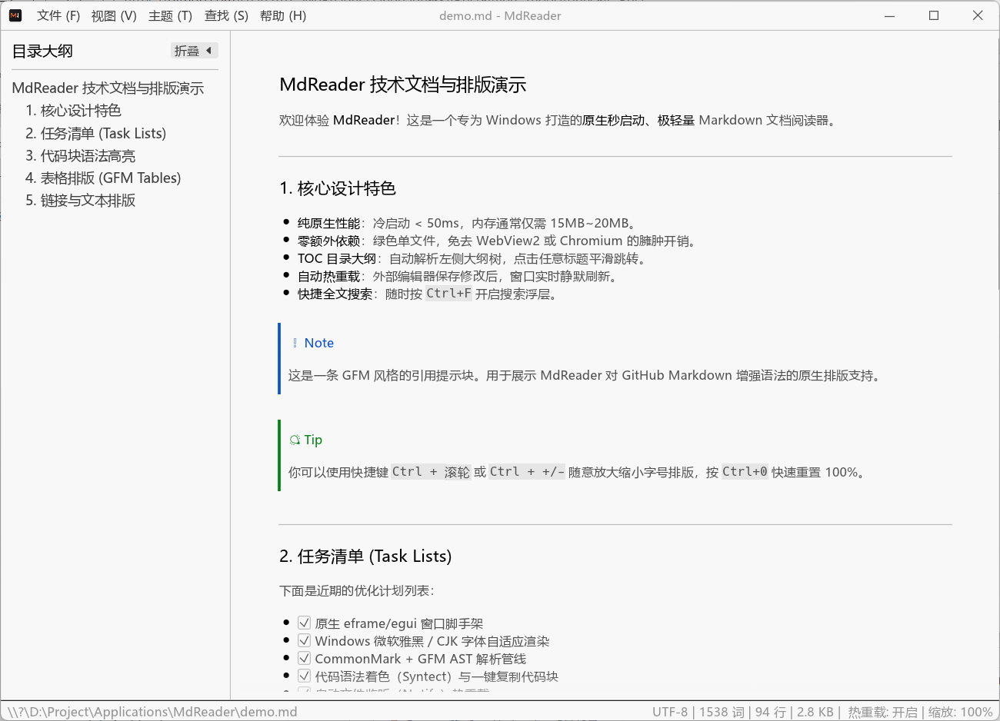
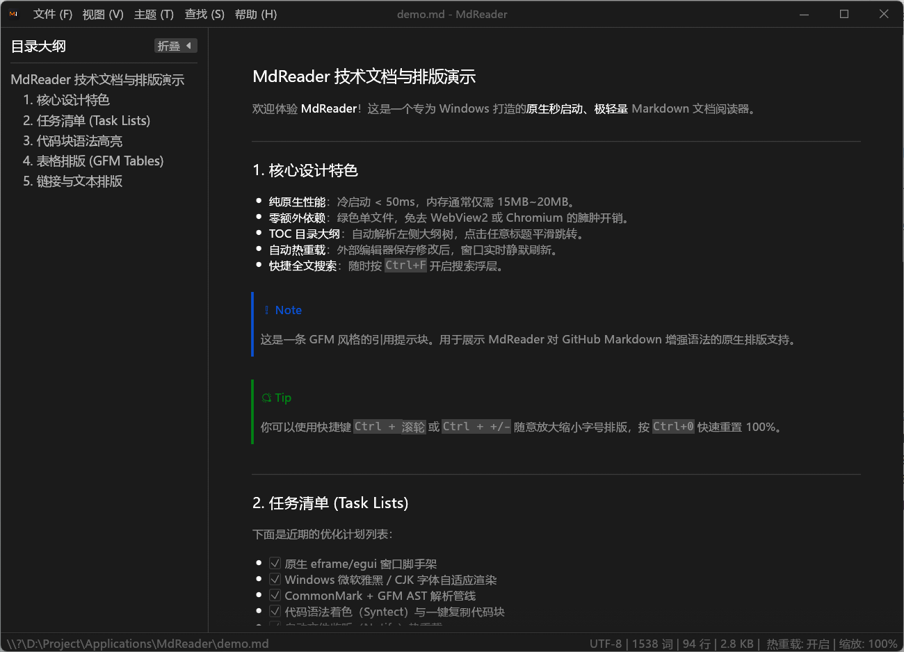

# MdReader (极速轻量 Markdown 查看器)

专为 Windows 平台打造的**极速秒启动、极低内存占用、纯原生** Markdown 文档阅读器。


---

## 🖼️ 界面预览

### 浅色模式



### 深色模式



## 🌟 核心特色

1. **秒级瞬时冷启动**：纯原生 Rust + egui 架构，无任何 Chromium / Electron / WebView2 运行时开销，冷启动耗时 < 50ms。
2. **极低内存占用**：基础运行内存仅 ~18MB，对比同类基于 Chromium/WebView2 的工具节省 80% 以上内存。
3. **纯绿色便携单文件**：编译为单个独立可执行文件 `mdreader.exe`（仅约 8MB），静态链接无任何外部 DLL 依赖，随拷随用，不向注册表写入额外垃圾。
4. **全套 GFM 排版支持**：
   - 标题、粗斜体、删除线、引用块与 GitHub 风格 Alerts（`[!NOTE]`, `[!TIP]`, 等）。
   - 代码块语法高亮（基于 `syntect`）与右上角一键复制代码。
   - GFM 数据表格排版与对齐。
   - 任务清单（Todo Checkbox）展示。
   - 本地相对/绝对路径图片自适应渲染。
5. **高效阅读与导航**：
   - **TOC 目录大纲树**：左侧智能折叠/展开大纲栏，点击直达对应章节。
   - **外部文件自动热重载**：使用外部编辑器保存后，窗口静默实时刷新并保持阅读流。
   - **全文快捷搜索 (Ctrl+F)**：支持页面内关键字匹配与上一个/下一个跳转。
   - **无级字号缩放**：支持 `Ctrl + 鼠标滚轮` 或 `Ctrl +/-` 缩放，`Ctrl+0` 一键重置。
   - **深色/浅色/跟随系统主题**。
   - **文件拖拽与传参**：支持直接将 `.md` 文件拖入窗口，或在命令行/右键关联打开。

---

## ⌨️ 常用快捷键

| 快捷键 | 功能说明 |
| :--- | :--- |
| `Ctrl + O` | 打开本地 Markdown 文件 |
| `F5` 或 `Ctrl + R` | 重新载入当前文档 |
| `Ctrl + F` | 开启 / 关闭页面全文搜索 |
| `Ctrl + T` | 展开 / 折叠左侧目录大纲栏 (TOC) |
| `Ctrl + +` / `Ctrl + =` | 放大界面与排版字号 |
| `Ctrl + -` | 缩小界面与排版字号 |
| `Ctrl + 0` | 重置缩放比例至 100% |
| `Ctrl + 鼠标滚轮` | 无级平滑缩放字号 |
| `Esc` | 关闭全文搜索栏 / 弹窗 |

---

## 🚀 编译与运行

### 1. 运行体验
```powershell
# 直接运行并打开演示文档
cargo run -- demo.md

# 或者直接双击或命令行启动 release 版
.\target\release\mdreader.exe demo.md
```

### 2. 编译发布为单文件绿色版
```powershell
cargo build --release
```
编译完成后，可在 `target\release\mdreader.exe` 获取最终的单文件免安装绿色版程序。

---

## 💡 如何设为 Windows 下 `.md` 文件的默认打开方式

1. 在任意 `.md` 文件上**右键**，选择 **「打开方式」->「选择其他应用」**。
2. 勾选 **「始终使用此应用打开 .md 文件」**。
3. 点击 **「更多应用」->「在这台电脑上查找其他应用」**。
4. 浏览并选中 `mdreader.exe`，点击确定即可完成关联。
